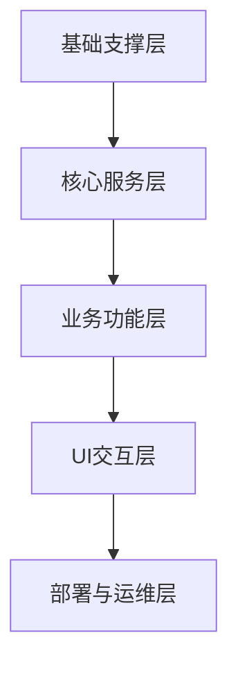

以下是基于Electron的B站多功能工具（视频下载+专栏爬取+直播录制）的**完整架构设计与实现方案**，涵盖核心模块、技术栈、交互流程、性能优化及实施步骤，确保覆盖番剧/影视等特殊内容、Fluent Design UI及高性能需求。

### **一、整体架构设计**  
采用“分层+模块化”架构，从底层到上层分为5层，各层职责清晰且低耦合，便于扩展和维护。  

#### **1. 基础支撑层（底层依赖）**  
**作用**：提供Electron运行环境、系统级能力及第三方工具依赖，是所有功能的基础。  

| 模块                | 技术选型                          | 核心职责                                                                 |
|---------------------|-----------------------------------|--------------------------------------------------------------------------|
| Electron基础环境    | Electron 28+                      | 主进程（Main）与渲染进程（Renderer）分离，提供跨平台窗口管理、系统API调用能力。 |
| 系统交互模块        | electron-sysinfo、node-gyp        | 获取系统信息（CPU/内存/磁盘）、调用系统通知（提示音、桌面弹窗）。           |
| 第三方工具集成      | ffmpeg（静态编译版）、7z          | 视频合并/格式转换、压缩包处理（用于批量导出专栏）。                         |
| 网络基础库          | axios、agentkeepalive、proxy-agent | 提供HTTP长连接、代理支持、请求重试的底层网络能力。                         |

#### **2. 核心服务层（通用能力封装）**  
**作用**：封装各业务共用的核心能力，避免重复开发，确保功能一致性。  

| 模块                | 技术选型                          | 核心职责                                                                 |
|---------------------|-----------------------------------|--------------------------------------------------------------------------|
| 网络请求服务        | 自定义封装（基于axios）           | 1. 统一处理B站API请求（携带Cookie、签名参数）；2. 实现请求池（长连接复用）、限速、重试策略；3. 解析API返回的加密数据（如番剧播放地址签名）。 |
| 数据解析服务        | cheerio、m3u8-parser、jsonpath    | 1. 解析HTML（专栏内容）、m3u8（视频/直播流）、JSON（API返回数据）；2. 提取视频分段URL、专栏图片、直播流地址等核心信息。 |
| 媒体处理服务        | fluent-ffmpeg、hls.js             | 1. 视频/音频分片合并、格式转换（MP4/FLV/MP3）；2. 直播流拉取与录制（支持hls/flv协议）；3. 字幕嵌入、画质调整（锐化/压缩）。 |
| 任务管理服务        | 自定义队列（基于EventEmitter）    | 1. 维护下载/录制任务队列（优先级排序、暂停/继续/删除）；2. 任务状态同步（主进程→渲染进程）；3. 断点续传（记录分片下载进度）。 |
| 数据存储服务        | electron-store、sqlite3           | 1. 轻量配置（用户设置、路径）用electron-store；2. 结构化数据（任务记录、本地资源库）用sqlite3；3. 缓存管理（视频元数据、Cookie）。 |
| 权限与风控服务      | tough-cookie、uuid                | 1. Cookie池管理（多账号登录态切换）；2. 生成设备指纹（避免B站风控）；3. 检测会员权限、地区限制（配合代理服务）。 |

#### **3. 业务功能层（核心功能实现）**  
**作用**：按“视频下载、专栏爬取、直播录制”三大场景拆分，调用核心服务层能力实现具体业务。  

##### **（1）视频下载子系统**  
| 模块                | 依赖核心服务                      | 核心职责                                                                 |
|---------------------|-----------------------------------|--------------------------------------------------------------------------|
| 链接解析器          | 网络请求服务、数据解析服务        | 1. 识别URL类型（BV号/番剧season_id/课程ID）；2. 调用对应API（普通视频用`/x/web-interface/view`，番剧用`/pgc/view/app/season`）；3. 提取视频元数据（标题、集数、画质列表、权限信息）。 |
| 权限验证器          | 权限与风控服务                    | 1. 检测视频是否需要会员/付费（解析`is_vip`/`purchase_status`字段）；2. 无权限时提示用户导入对应Cookie；3. 处理地区限制（自动切换代理）。 |
| 分片下载器          | 网络请求服务、任务管理服务        | 1. 多线程下载m3u8分片（并发数由用户设置）；2. 实时计算进度（已下载分片/总分片）；3. 支持断点续传（记录已下载分片的MD5）。 |
| 视频合成器          | 媒体处理服务                      | 1. 调用ffmpeg合并分片为完整视频；2. 按用户设置转换格式（如MP4）、嵌入字幕；3. 清理临时分片文件。 |
| 批量任务管理器      | 任务管理服务、数据存储服务        | 1. 支持导入TXT批量添加BV号/集数；2. 按“选集”“季数”批量创建任务；3. 自动按类型创建文件夹（如“番剧/XXX/第1集.mp4”）。 |

##### **（2）专栏爬取子系统**  
| 模块                | 依赖核心服务                      | 核心职责                                                                 |
|---------------------|-----------------------------------|--------------------------------------------------------------------------|
| 专栏解析器          | 网络请求服务、数据解析服务        | 1. 解析CV号/URL，调用`/x/article/view`获取专栏元数据（标题、作者、发布时间）；2. 提取正文HTML、图片URL、附件链接。 |
| 内容处理器          | 数据解析服务、媒体处理服务        | 1. 清洗HTML（去除广告、相关推荐）；2. 下载图片并替换为本地路径；3. 转换为Markdown/HTML/EPUB格式（保留排版）。 |
| 导出管理器          | 数据存储服务、系统交互模块        | 1. 按用户设置的路径导出文件；2. 批量导出时压缩为ZIP（含图片+正文）；3. 记录导出历史（支持重新导出）。 |

##### **（3）直播录制子系统**  
| 模块                | 依赖核心服务                      | 核心职责                                                                 |
|---------------------|-----------------------------------|--------------------------------------------------------------------------|
| 直播间解析器        | 网络请求服务、数据解析服务        | 1. 解析直播间ID，调用`/xlive/web-room/v1/index/getRoomBaseInfo`获取直播状态（是否开播）；2. 获取流地址（hls/flv）、画质列表（原画/高清）。 |
| 录制控制器          | 媒体处理服务、任务管理服务        | 1. 按用户设置启动/停止录制（支持定时录制、时长限制）；2. 切片录制（如每30分钟生成一个文件）；3. 实时监控流状态（断流时自动重试）。 |
| 多直播间管理器      | 任务管理服务、系统交互模块        | 1. 支持同时录制多个直播间（并发数由用户设置）；2. 按直播间名称创建文件夹；3. 录制完成后发送系统通知。 |

#### **4. UI交互层（用户界面）**  
**作用**：基于Fluent Design实现现代化扁平化界面，处理用户交互并同步任务状态。  

| 模块                | 技术选型                          | 核心职责                                                                 |
|---------------------|-----------------------------------|--------------------------------------------------------------------------|
| 导航与布局          | React + Fluent UI React          | 1. 左侧导航栏（视频/专栏/直播/设置），采用亚克力半透明效果；2. 主界面卡片式布局（任务列表、设置面板）。 |
| 视频下载界面        | Fluent UI 组件（Tabs、Dropdown） | 1. URL输入框（支持拖拽粘贴）、批量导入按钮；2. 视频信息卡片（封面、标题、画质/音质选择器）；3. 任务列表（进度条、速度、操作按钮）。 |
| 专栏爬取界面        | 同上                              | 1. CV号输入框、预览按钮；2. 导出格式选择（MD/HTML/EPUB）；3. 爬取进度展示。 |
| 直播录制界面        | 同上                              | 1. 直播间ID输入框、开播状态监控；2. 录制设置（切片时间、格式）；3. 正在录制列表（实时时长、暂停按钮）。 |
| 设置界面            | Fluent UI 表单组件               | 1. 通用设置（通知提示音、存储路径）；2. 视频设置（默认画质/编码、并发数、命名规则）；3. 网络设置（代理、限速）。 |
| 本地资源库界面      | React Table、搜索组件            | 1. 按类型（视频/专栏）分类展示本地文件；2. 支持关键词搜索、播放进度记忆；3. 右键菜单（打开文件/文件夹、删除）。 |
| 动效与反馈          | Framer Motion、electron-notifier  | 1. 按钮hover动效、任务状态切换过渡（300ms淡入）；2. 任务完成时系统通知（带“打开文件”按钮）；3. 错误提示（toast弹窗）。 |

#### **5. 部署与运维层**  
**作用**：确保应用可打包、更新、监控，降低维护成本。  

| 模块                | 技术选型                          | 核心职责                                                                 |
|---------------------|-----------------------------------|--------------------------------------------------------------------------|
| 应用打包            | electron-builder                  | 1. 打包为多平台安装包（Windows.exe、macOS.dmg、Linux.deb）；2. 配置图标、版本信息、权限（如Windows管理员权限用于写入系统目录）。 |
| 自动更新            | electron-updater                  | 1. 检查GitHub/Gitee仓库的更新包；2. 增量更新（仅下载差异文件）；3. 更新完成后提示重启。 |
| 日志与监控          | winston、electron-log             | 1. 记录操作日志（任务开始/完成/错误）、性能日志（CPU/内存占用）；2. 日志本地存储（按日期分割），支持用户导出排查问题。 |
| 合规性组件          | 自定义弹窗                        | 1. 首次启动显示用户协议（强调“个人学习使用”）；2. 版权标注（底部显示“内容版权归B站及原作者所有”）。 |

### **二、核心交互流程（以“番剧下载”为例）**  
1. **用户输入与解析**：  
   - 用户在UI输入番剧URL（如`https://www.bilibili.com/bangumi/play/ssXXXX`），点击“解析”。  
   - 渲染进程通过IPC发送URL到主进程，主进程调用**链接解析器**（视频下载子系统）。  
   - 解析器识别为番剧，调用`/pgc/view/app/season` API获取季信息（总集数、每集`episode_id`），返回渲染进程显示集数列表。  

2. **任务创建与权限验证**：  
   - 用户勾选“1-5集”，选择画质（1080P），点击“下载”。  
   - 主进程调用**权限验证器**，检查是否为会员（解析API返回的`vip_status`），若需会员则提示导入Cookie。  
   - 验证通过后，**批量任务管理器**创建5个下载任务，加入任务队列（按顺序排序）。  

3. **分片下载与合并**：  
   - **任务管理服务**调度首个任务，**分片下载器**调用网络请求服务获取该集的m3u8分片URL。  
   - 按用户设置的并发数（如3线程）下载分片，实时通过IPC同步进度到UI（进度条+速度）。  
   - 分片下载完成后，**视频合成器**调用ffmpeg合并分片，转换为MP4格式（按用户设置），并嵌入字幕（若勾选）。  

4. **完成与反馈**：  
   - 合并完成后，**数据存储服务**记录任务到本地数据库（状态“已完成”+文件路径）。  
   - **系统交互模块**触发提示音+桌面通知（“番剧第1集下载完成”），UI任务列表更新状态。  

### **三、性能优化方案**  
1. **网络层优化**：  
   - 长连接池：对B站API使用`agentkeepalive`，复用TCP连接（减少30%握手耗时）。  
   - 智能缓存：视频元数据（番剧集数、画质列表）缓存24小时，避免重复请求。  
   - 动态限速：根据当前网速调整并发数（网速<1MB/s时并发=1，>5MB/s时并发=4）。  

2. **本地处理优化**：  
   - 分片流式写入：大文件（>1GB）按50MB分片下载，实时写入磁盘（避免内存溢出）。  
   - 多线程隔离：用`worker_threads`处理视频合并（独立线程，不阻塞主进程）。  
   - 磁盘IO调度：批量下载时按“先下载后合并”顺序执行，避免多任务同时写入同一磁盘。  

3. **任务调度优化**：  
   - 优先级队列：小文件（如课程视频）优先下载，减少用户等待感。  
   - 资源自适应：CPU占用>80%时自动降低并发数，内存不足时暂停合并任务。  

### **四、技术栈与实施步骤**  
#### **技术栈汇总**  
| 层          | 核心技术/库                          |  
|-------------|--------------------------------------|  
| 主进程      | Node.js、Electron API、electron-store |  
| 渲染进程    | React、Fluent UI React、Framer Motion |  
| 网络与解析  | axios、cheerio、m3u8-parser          |  
| 媒体处理    | fluent-ffmpeg、hls.js                |  
| 数据存储    | sqlite3、electron-store              |  
| 打包与更新  | electron-builder、electron-updater   |  

#### **实施步骤（分5阶段）**  
1. **基础搭建（2周）**：  
   - 初始化Electron项目，配置主进程与渲染进程通信（IPC）。  
   - 集成Fluent UI组件库，实现基础布局（导航栏、设置面板）。  
   - 封装网络请求服务（含Cookie管理、重试策略）。  

2. **核心功能开发（4周）**：  
   - 视频下载子系统：完成普通视频解析、下载、合并；适配番剧/影视API。  
   - 专栏爬取子系统：实现HTML解析、Markdown导出。  
   - 直播录制子系统：完成直播间状态监控、流录制功能。  

3. **性能优化（2周）**：  
   - 实现分片下载、多线程合并、缓存策略。  
   - 优化任务队列调度，解决大文件下载卡顿问题。  

4. **UI完善与测试（2周）**：  
   - 细化Fluent Design动效（按钮hover、进度条动画）。  
   - 测试多类型视频（番剧/电影/课程）下载兼容性，修复权限问题。  

5. **打包与发布（1周）**：  
   - 配置electron-builder打包多平台安装包。  
   - 集成自动更新功能，编写用户协议与版权声明。  

### **五、合规性与风险控制**  
1. **用户协议**：首次启动强制勾选“仅用于个人学习，不得商用或传播”。  
2. **权限提示**：下载会员/付费内容时，二次确认“已获得合法授权”。  
3. **日志脱敏**：本地日志隐藏Cookie、文件路径等敏感信息，仅记录任务ID和状态。  
4. **反爬规避**：请求频率控制在B站API限制内（如单IP每分钟<60次），避免触发风控。  
